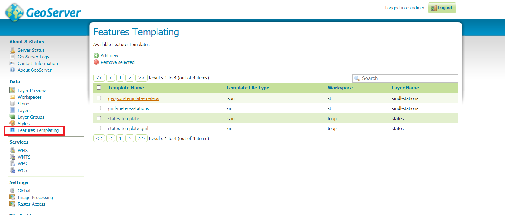

.. _template-directives:

Template Configuration
======================

This part of the documentation explain how to add new templates to GeoServer and how to define rules from a vector layer configuration page in order to define under which condition the template should be applied.

Add features templates to GeoServer
------------------------------------

Once the plug-in is installed, in the left panel of the GeoServer UI will show up a new option ``Feature Templating`` under the ``Data`` section.
By clicking on it a table with available templates will be presented.

By clicking on :guilabel:``add New`` button the configuration page will open.

.. figure:: images/template-ui.png

In the first tab the user can specify the following values:

* the :guilabel:``Template Name``. This name will be the one used for the template file name when saved in the data dir.
* the :guilabel:``Template File Type`` (file extension) of the template, by selecting one among those available.
* the :guilabel:``Workspace`` if the user want to reduce the scope of usage of the templates to the vector layers available in a specific workspace.
* the :guilabel:``Layer Name`` if the user want to reduce the scope of usage of the templates to a specific vector layer only.

The :guilabel:``Workspace`` and :guilabel:``Layer Name`` values, if specified, will affect also the place where the template will be saved:

* if none is specified the template will be saved inside the :code:``features-templating`` directory.
* if a :guilabel:``Workspace`` is specified the template will be saved in that workspace folder.
* if a :guilabel:``Layer Name`` is specified the template will be saved in that layer folder.

