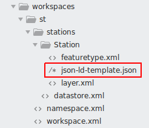

JSON-LD configuration
=====================
 
A template file that operates as a second level mapping over a stream of features needs to be provided for each feature type (layer) that should be outputted as a JSON-LD document. **This template is mandatory, without it an exception will be throw if JSON-LD is requested as the output format for the feature type (layer)**.  

The JSON-LD template file is always named ``json-ld-template.json`` and is stored along side the feature type.

   The Station feature type is associated with a JSON-LD template.

The template file structure
---------------------------

The template file is basically the desired structure of the JSON-LD output document whit directives, following a specific syntax, to retrieve the necessary values from the features coming from the stream of features. It will also be possible to execute CQL functions to transform the retrieved values. 

The template will be applied to one feature at the time, it is not possible to do something like: *retrieve this value from the first feature and this value from the second feature*; although it will be possible to encode complex features nested collections.  

Usually the template file as three main sections, although none of them is mandatory:

.. code-block:: json

  {   
    
    "@hints": {
      (...)
    },

    "@context": {
      (...)
    },

    "type": "FeatureCollection",
    "features": [
      (...)
    ]

  }

The ``hints`` section allow us to provide a few hints that will be used by the plugin for encoding the JSON-LD document or interpreting filters. The ``context`` section is usually static and defines the JSON-LD context. The ``features`` section is were we the features will be encoded, hence this is were we will use the available directives.  

Template directives
-------------------

Several directives are available to be used in the template, follows their description:

* Static values associated with JSON-LD properties are reproduced in the output as-is;

* XPath property interpolation can be invoked using :code:`${xpath}` syntax, this directive allow us to retrieve attributes values from simple or complex features;

* CQL expressions can be used with :code:`$${cql}` syntax, all CQL functions available in GeoServer are supported;

* Directive :code:`"$source":"<XPATH>"` can used as the first element of an array or of an object, this is used to instruct the plugin that, respectively, a list of features or a referenced feature should be encoded; 

* When the :code:`"$source": "<XPATH>"` directive is present, it will act as a context against which all sub XPath expressions will be evaluated. 

* In the case of an array it will be use to iterate over a collection of features and all child XPath expressions will be evaluated against the element the iterator is pointing to; 

* If the provided XPath evaluates to NULL the entire object or array will be skipped;
  
The prefix :code:`../` can be used, multiple times, in a XPath making it evaluate relatively to a parent :code:`$source`. 

Template example
----------------

Follows the example of a JSON-LD template configuration file: 

.. code-block:: json

  {
  "@hints": {
     "gsml": "urn:cgi:xmlns:CGI:GeoSciML:2.0",
     "om": "http://www.opengis.net/om/1.0",
     "sa": "http://www.opengis.net/sampling/2.0",
     "xlink": "http://www.w3.org/1999/xlink",
     "gml": "http://www.opengis.net/gml"
   },
   "@context": {
     "gsp": "http://www.opengis.net/ont/geosparql#",
     "sf": "http://www.opengis.net/ont/sf#",
     "schema": "https://schema.org/",
     "dc": "http://purl.org/dc/terms/",
     "Feature": "gsp:Feature",
     "FeatureCollection": "schema:Collection",
     "Point": "sf:Point",
     "wkt": "gsp:asWKT",
     "features": {
       "@container": "@set",
       "@id": "schema:hasPart"
     },
     "geometry": "sf:geometry",
     "description": "dc:description",
     "title": "dc:title",
     "name": "schema:name"
   },
   "type": "FeatureCollection",
   "features": [
     {
       "$source": "gsml:MappedFeature"
     },
     {
       "@id": "${@id}",
       "@type": [
         "Feature",
         "gsml:MappedFeature",
         "http://vocabulary.odm2.org/samplingfeaturetype/mappedFeature"
       ],
       "name": "${gml:name}",
       "gsml:positionalAccuracy": {
         "type": "gsml:CGI_NumericValue",
         "value": "${gsml:positionalAccuracy/gsml:CGI_NumericValue/gsml:principalValue}"
       },
       "gsml:GeologicUnit": {
         "$source": "gsml:specification/gsml:GeologicUnit",
         "@id": "${@id}",
         "description": "${gml:description}",
         "gsml:geologicUnitType": "urn:ogc:def:nil:OGC::unknown",
         "gsml:composition": [
           {
             "$source": "gsml:composition"
           },
           {
             "gsml:compositionPart": [
               {
                 "$source": "gsml:CompositionPart"
               },
               {
                 "gsml:role": {
                   "value": "${gsml:role}",
                   "@codeSpace": "urn:cgi:classifierScheme:Example:CompositionPartRole"
                 },
                 "proportion": {
                   "$source": "gsml:proportion",
                   "@dataType": "CGI_ValueProperty",
                   "CGI_TermValue": {
                     "@dataType": "CGI_TermValue",
                     "value": {
                       "value": "${gsml:CGI_TermValue}",
                       "@codeSpace": "some:uri"
                     }
                   }
                 },
                 "lithology": [
                   {
                     "$source": "gsml:lithology"
                   },
                   {
                     "@id": "${gsml:ControlledConcept/@id}",
                     "name": {
                       "value": "${gsml:ControlledConcept/gsml:name}",
                       "@lang": "en"
                     },
                     "vocabulary": {
                       "@href": "urn:ogc:def:nil:OGC::missing"
                     }
                   }
                 ]
               }
             ]
           }
         ]
       },
       "geometry": {
         "@type": "Polygon",
         "wkt": "$${toWKT(xpath('gsml:shape'))}"
       }
     }
   ]
  }

Given the above template file, the XPath: 

  ::

      ../gsml:shape

Will be evaluate not against the corresponding:

  ::
  
      $source": "gsml:specification/gsml:GeologicUnit

But against the parent one:

  ::
  
      "$source": "gsml:MappedFeature"